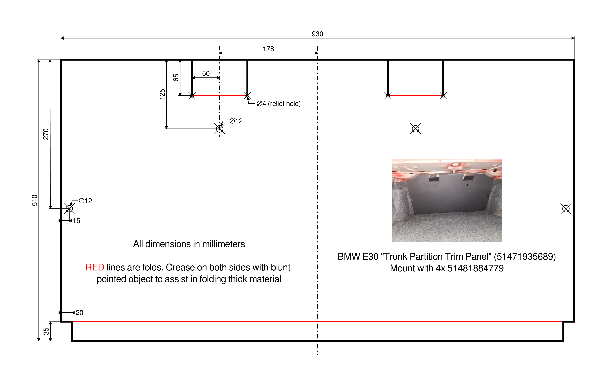

# Trunk Partition Trim Panel Reproduction

This folder contains a cutting template for reproducing the "Trunk Partition Panel #51471935689" found behind the rear seats of the BMW E30. This panel covers the body-colored metal divider between the cabin and trunk. With it being made from paper, and trunk leaks being prevalent in E30s, this part usually ends up moldy and degraded. Unfortunately, it is NLA from BMW and hard to find in good condition secondhand due to the aforementiond reasons. 

Mounts with 4 expanding clips #51481884779.

## Recommended Material

- Material: Paperboard/Matboard/Mounting board, dyed black throughout
- Thickness: 1.5–3mm (approx. 1/16"-1/8")
- Sheet size: At least 930mmx510mm or 37"x21" 
- Source: Most art supply or craft stores (e.g., Blick, Michaels, or similar)

I have used [this specific material](https://www.deserres.ca/products/peterboro-black-on-black-cardboard?srsltid=AfmBOoocEm6i-aeVCU5hZLOetc5aoGgr1GNlRYw3pnXa67AJTuiKjQNV&variant=39426648178821) for my reproduction.

Avoid using cheap posterboard since that material is usually only colored on the surface. Any scratches or dings will immediately expose the white paper core.

## Construction tips

- Crease the material at the fold lines with a blunt pointed object to ease folding of the thick material
- The mounting holes don't have to be exactly 12mm, nor do they have to be pretty, since the flanges on the mounting clips will hide them. I've drilled mine out with a 1/2" spade bit.
